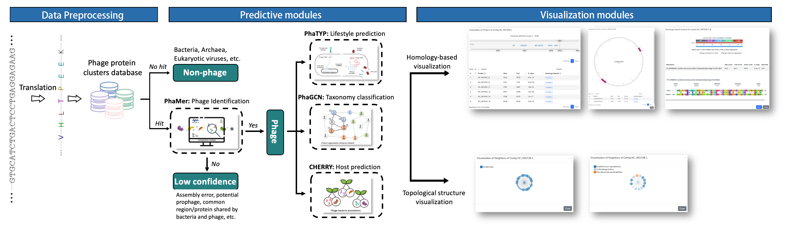

### Welcome to Jiayu's research space 

<table border="0">
  <tr>
    <td width="60%">
      <h1>Jiayu SHANG</h1>
      
<b>Dept. of Electrical Engineering</b>

      
<b>City University of Hong Kong</b>

      
<b>jyshang2-c AT cityu DOT edu DOT hk</b>

       
<a href="/publication.html">[Publication]</a><a href="/News.html">[News]</a><a href="https://scholar.google.com/citations?user=pz7piN8AAAAJ">[Google Schoolar]</a>

      

        <a href="https://github.com/KennthShang">[GitHub]</a><a href="/imgs/SHANG_Jiayu_CV.pdf">[CV]</a>
      

    </td>
    <td width="40%">
      
    </td>  
  </tr>
</table>

---

Jiayu SHANG is an Ph. D. student in the Department of Electrical Engineering at City University of Hong Kong.  He received the B.S. degrees from Sun Yat-sen University (Guangdong, China) in Computer Science. His research field is bioinformatics and computational biology. In particular, His recent research projects include applying deep learning models in biological sequence analysis, next-generation sequencing data analysis, metagenomics, protein domain annotation.

---
## EDUCATION

- Ph.D. in Electrical Engineering, City University of Hong Kong, Hong Kong, China SAR.
  - Advisor: [Dr. Yanni Sun](https://scholar.google.com/citations?user=1wloHDIAAAAJ).

- B.S. in Computer Science, Sun Yat-sen University, Guangdong, China.

## Research Interests

- Computational biology and Bioinformatics
- Deep learning-based sequence analysis
- BIG genomic data mining
- Algorithm design and tool development

1. Microbial community analysis using high-throughput sequencing data
   - Composition analysis of metagenomics data sequenced from host-associated or environmental samples

2. Virus diversity analysis using deep sequencing data

   - Viral population characterization using shot-gun deep sequencing data
   - Virus identification, classification, and host prediction using deep learning models
   
4. Algorithm design for mining third-generation sequencing data

   - Error correction of long reads

   - De novo assembly of virus genomes using long reads

## News

A new integrated software named PhaBOX for phage sequence analysis has been developed!

To try PhaBOX, please click the link [PhaBOX](https://phage.ee.cityu.edu.hk/)

## Visit Map

